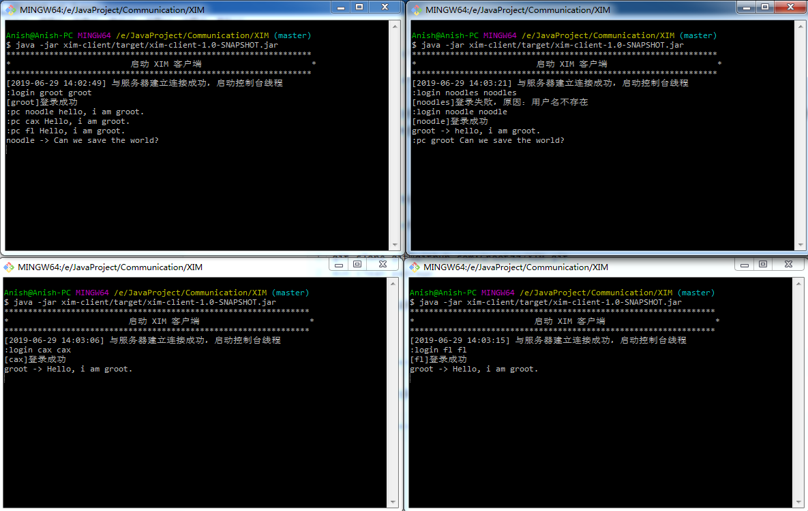
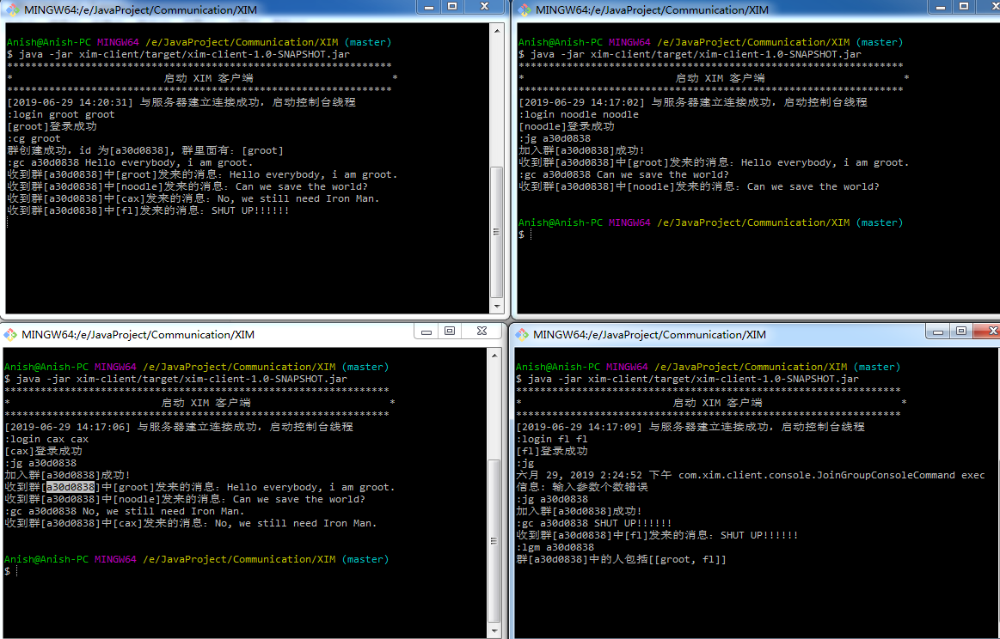

# X-IM 即时通信助手

- [介绍](#介绍)
- [快速启动](#快速启动)
- [系统架构](#系统机构)
- [部分功能演示](#部分功能演示)
- [TODO](#模块介绍)

## 介绍

X-IM是一个基于Netty的即时通信系统，适用于需要发起即时通信的环境。

在目前的版本中，X-IM支持群聊和私聊功能，除了这两个基本功能外，还支持下表中的命令所对应的功能。

| 命令      | 描述                             | 示例                       |
| --------- | -------------------------------- | -------------------------- |
| `:login`  | 使用用户名和和密码登录           | `:login` username pwd      |
| `:logout` | 登出                             | `:logout`                  |
| `:cg`     | `create group`, 创建群           | `:cg` group_name           |
| `:jg`     | `join group`, 加入群             | `:jg` group_name           |
| `:qg`     | `quict group`, 退出群            | `:qg` group_name           |
| `:lqm`    | `list group members`，查看群成员 | `lqm` group_name           |
| `:gc`     | `group chat`，群聊               | `:gc` group_name input_msg |
| `:pc`     | `private chat`，私聊             | `:pc` username             |

由于本项目的设计目标在于消息即时性，所有数据的存储采用均采用redis完成，实际上这并不是一个很好的方案。未来改进中会考虑继续改进。

## 快速启动

由于项目采用redis存储数据，所以在启动之前，需要安装好redis。

**第一步**：使用maven构建工程

```
git clone git@github.com:Grootzz/XIM.git
mvn clean package
```

**第二步**：启动服务端和客户端，在目前的版本中只支持启动一个server。

启动server：

```
jar -jar xim-server/target xim-server-1.0-SNAPSHOT.jar
```

启动client（可启动多个）：

```
jar -jar xim-client/target xim-client-1.0-SNAPSHOT.jar
```

## 部分功能演示

**私聊**



**群聊**



## TODO

- [ ] db层使用MYSQL，让数据可以持久化 
